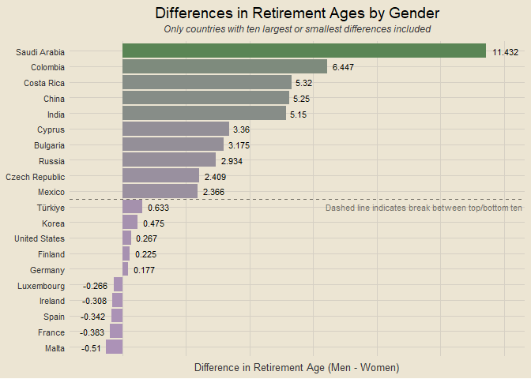

Makeover Monday Visualizations
================

Sharing weekly visualizations from the [Makeover
Monday](https://data.world/makeovermonday) series.

------------------------------------------------------------------------

# Contents

- [Importing Required Packages](#importing-required-packages)
- [2023 Week 14: Chicago Hate Crimes](#week-14-chicago-hate-crimes)
- [2023 Week 15: The DougScore](#week-15-the-dougscore)
- [Script Runtime](#script-runtime)

### Importing Required Packages

``` r
tictoc::tic()

library(tidyverse)
library(tidymodels)
library(lubridate)
library(tvthemes)
library(janitor)
library(patchwork)
library(readxl)
library(vip)

theme_custom = theme_avatar() +
  theme(plot.title = element_text(hjust = 0.5),
        plot.subtitle = element_text(hjust = 0.5, size = 9, vjust = 2.5, face = "italic"),
        panel.grid.major = element_line(linewidth = 0.5, colour = "#D6D0C4"),
        panel.grid.minor = element_line(linewidth = 0.5, colour = "#D6D0C4"))

theme_set(theme_custom)
custom_olive = "#8C9F88"
```

### 2023 Week 14: Chicago Hate Crimes

*Data about hate crimes in Chicago from the Chicago Police Department*

<details>
<summary>
View Code
</summary>

``` r
df = clean_names(read_excel("data/chicago_hate_crimes.xlsx"))

five_digit_dates = df |>
  filter(nchar(date) == 5) |>
  mutate(date = as.Date(as.numeric(date), origin = "1899-01-01"))

digits_21_dates = df |>
  filter(nchar(date) == 21) |>
  mutate(date = mdy(substr(date, 1, 9)))

digits_22_dates = df |>
  filter(nchar(date) == 22) |>
  mutate(date = mdy(substr(date, 1, 10)))

df2 = bind_rows(five_digit_dates, digits_21_dates, digits_22_dates)

df2 |>
  count(date) |>
  group_by(year(date)) |>
  mutate(cum_n = cumsum(n)) |>
  ungroup() |>
  mutate(date = as_date(paste0("2020-", substr(as.character(date), 6, 10))),
         `year(date)` = factor(`year(date)`)) |>
  rename(year = "year(date)") |>
  filter(year %in% 2017:2023) |>
  ggplot(aes(date, cum_n)) +
  geom_line(aes(col = year), linewidth = 2) +
  scale_x_date(date_labels = c("December", "January", "April", "July", "October")) +
  theme(legend.position = "right") +
  labs(x = NULL, y = "Cumulative Sum",
       title = "Cumulative Sum of Hate Crimes in Chicago, 2017-2023", col = "Year")
```

</details>

<!-- -->

------------------------------------------------------------------------

### 2023 Week 15: The DougScore

*Which cars are the best cars ever driven by Doug Demuro?*

<details>
<summary>
View Code
</summary>

``` r
df = clean_names(read_excel("data/doug_data.xlsx"))

makes_df = df |>
  count(make) |>
  filter(n >= 12) |>
  mutate(make_n = paste0(make, " (", n, ")"))

boxplots = df |>
  right_join(makes_df, by = "make") |>
  ggplot(aes(reorder(make_n, dougscore), dougscore)) +
  geom_boxplot(aes(fill = make_n), show.legend = F) +
  coord_flip() +
  scale_fill_manual(values = c("#002420", "#EB0D3F", "#1B5FAA", "#009ADA",
                               "#A87A25", "#972626", "#00A551", "#004377",
                               "#CC0000", "#F7DE9F", "#DFE1E0", "#FF8000",
                               "#565F64", "#B12B28", "#004489", "#F5313E")) +
  labs(x = NULL, y = "DougScore", title = "Boxplots of DougScores by Vehicle Make",
       subtitle = "Only Vehicles with 12+ Observations Included") +
  theme(plot.subtitle = element_text(hjust = 0.5, size = 9, face = "italic", vjust = 2))

df = df |>
  select(year, styling, acceleration, handling, fun_factor,
         cool_factor, features, comfort, quality, practicality, value, dougscore)

# cars_split = initial_split(df, strata = dougscore)
# cars_train = training(cars_split)
# cars_test = testing(cars_split)
cars_rec = recipe(dougscore ~ ., data = df)
# cars_prep = prep(cars_rec)
# juiced = juice(cars_prep)

# these hyperparameters were obtained from tuning
tune_spec = rand_forest(trees = 153, mtry = 7, min_n = 2) |>
  set_mode("regression") |>
  set_engine("ranger")

tune_wf = workflow() |>
  add_recipe(cars_rec) |>
  add_model(tune_spec)

# cars_folds = vfold_cv(cars_train, v = 5)
# doParallel::registerDoParallel()
# tune_res = tune_grid(tune_wf, resamples = cars_folds, grid = 25)
# best_rmse = select_best(tune_res, "rmse")
# final_rf = finalize_model(tune_spec, best_rmse)

vip_plot = tune_spec |>
  set_engine("ranger", importance = "permutation") |>
  fit(dougscore ~ ., data = df) |>
  vip(geom = "point") +
  labs(title = "Variable Importance for Predicting DougScore")

boxplots / vip_plot
```

</details>

<!-- -->

------------------------------------------------------------------------

### 2023 Week 16: Retirement Ages Around the World

*At what age do people retire around the world?*

**This one is still in progress!**

``` r
df = clean_names(read_excel("data/market_exit_age.xlsx")) |>
  mutate(country = ifelse(country == "China (People's Republic of)", "China", country))

top_countries = df |>
  group_by(country, gender) |>
  summarise(age = round(mean(average_age), 3),
            .groups = "drop") |>
  pivot_wider(id_cols = country, names_from = "gender", values_from = "age") |>
  mutate(diff = men - women) |>
  filter(country != "European Union (27 countries)") |>
  slice_max(diff, n = 10) |>
  pull(country)

bottom_countries = df |>
  group_by(country, gender) |>
  summarise(age = round(mean(average_age), 3),
            .groups = "drop") |>
  pivot_wider(id_cols = country, names_from = "gender", values_from = "age") |>
  mutate(diff = men - women) |>
  filter(country != "European Union (27 countries)") |>
  slice_min(diff, n = 10) |>
  pull(country)

df |>
  group_by(country, gender) |>
  summarise(age = round(mean(average_age), 3),
            .groups = "drop") |>
  pivot_wider(id_cols = country, names_from = "gender", values_from = "age") |>
  mutate(diff = men - women) |>
  filter(country %in% c(top_countries, bottom_countries)) |>
  ggplot(aes(reorder(country, diff), diff)) +
  geom_col(aes(fill = diff), show.legend = F) +
  geom_text(aes(label = round(diff, 3)), size = 3, hjust = -0.25) +
  coord_flip() +
  scale_fill_gradient(low = "#AC92B7", high = "#5A8555") +
  geom_vline(xintercept = 10.5, linetype = "dashed", alpha = 0.5) +
  labs(x = NULL, y = "Difference in Retirement Age (Men - Women)",
       title = "Differences in Retirement Ages by Gender",
       subtitle = "Only countries with ten largest or smallest differences included")
```

<!-- -->

### Script Runtime

    ## 5.12 sec elapsed
